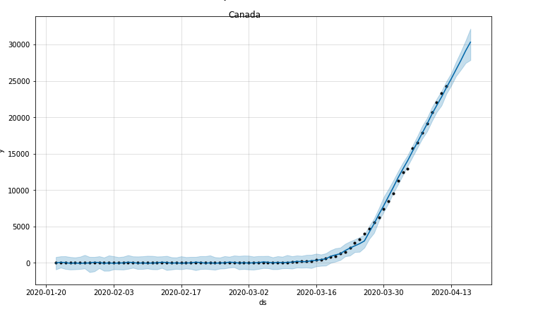

#Data Scientist Udacity Capstone Project

###Covid-19 cases predictions
###Sravan Kumar Kannuri
###April 19,2020

## Libraries use
1. pandas
2. numpy
3. matplotlib 
4. fbprophet
5. seaborn

##I. Definition
Predicting covid-19 infections country wise 

###Project Overview

Coronavirus disease (COVID-19) is an infectious disease caused by a newly discovered coronavirus.

Most people infected with the COVID-19 virus will experience mild to moderate respiratory illness and recover without requiring special treatment.  Older people, and those with underlying medical problems like cardiovascular disease, diabetes, chronic respiratory disease, and cancer are more likely to develop serious illness.

The best way to prevent and slow down transmission is be well informed about the COVID-19 virus, the disease it causes and how it spreads. Protect yourself and others from infection by washing your hands or using an alcohol based rub frequently and not touching your face. 

[Govt](https://www.dshs.texas.gov/coronavirus/)

[Research Papaers](https://ieeexplore.ieee.org/abstract/document/8963903)

###Problem Statement

* Can a machine learning model predicts the future infections count? Which helps govt and healthcare systems take precautionary steps.

###Metrics
MAPE Mean Absolute Percentage Error for evaluation.

##II. Analysis

###Data Exploration

I have downloaded covid-19 datasets from govermanament websites

[Data](https://www.dshs.texas.gov/coronavirus/)

Provided data is time series related.

###Label data: 

1. Id - Serial Number
1. Province_State - Respective State of the Country
1. Country_Region - Country Name
1. Date : Date(yyy-mm-dd) format
1. ConfirmedCases : Total cases till provided date(It's a cumilative number)
1. Fatalities : Total deaths till provided date(It's a cumilative number)

####The Shape of the data is (27231, 6)

####abnormalities

There are abnormalities like of NAN values. In order to get the consistency, there are multiple methodologies.

1. Remove NAN values
2. Keep 0 as stock price for missing data
3. Adding monthly mean values
4. Forward Fill and Backward Fill
5. Replacing with blank values

I took the Replacing with blank values approach as state names are missing for some countries.

###Exploratory Visualization
Used scatter plot to visualize total world wide Covid-19 cases and deaths representation

10 hostspot countries of covid19 cases

Total 10 hostspot cases states of covid19 cases within US

###Algorithms and Techniques
To solve the problem I have used fbprophet with default values.

As we have timeseries data in freequecy day wise, fbprophet will be a right fit to forecast the data. 

The input to Prophet is always a dataframe with two columns: ds and y. The ds (datestamp) column should be of a format expected by Pandas, ideally YYYY-MM-DD for a date or YYYY-MM-DD HH:MM:SS for a timestamp. The y column must be numeric, and represents the measurement we wish to forecast.

[Facebook Prophet](https://facebook.github.io/prophet/docs/quick_start.html)

###Benchmark
Simple linear regression serves the purpose for predictions to finds the relationship between dependent and independent variables. 
We can simply consider total cases ignoring dates and we can build a model by splitting train and test data which will give accurate prediction.
But with this approach we are going to loose the properties of time series. Model always required dependent variable for prediction and other issues are

1. It just assumes there is a straight line relationship between them.

2. It looks for data independent in nature

3. It only looks for mean of Dependent Variable

Here with FbProphet approach will train the time series data based on frequency of daily so that we can simply ask answers for futures dates which is independent nature.
If we have data in hourly then we can train and get the predictions for next hour which is very real time approach and over a period of time data grows and model predicts more accurately.
Due to time series we can check and apply any seasonality like if weather or big events plays impact on some stocks like amusement parks and sports which are seasonal in nature.

##III. Methodology

###Data Preprocessing
There is abnormalities like of missing data in-between. In order to get the consistency, there are multiple methodologies.

1. Remove NAN values
1. Keep 0 as stock price for missing data
1. Adding monthly mean values
1. Forward Fill and Backward Fill
1. Replacing with blank values

I took the Replacing with blank values approach as state names are missing for some countries.

###Implementation
####Challenges : 

#####1. Data Types : 
As per the prophet documentation, accepts only limited data types to train, test and predictions.  Converting data frame to required formats was quite a challenging task
#####2. Overfitting :
Efficiency of a model is judged by its ability to perform well on an unseen data set and not by its performance on the training data fed to it.
#####3. Hyper-parameter Optimization : 
As there are limited documentation it is very difficulty to work with hyper-parameters tuning. If accuracy is not good then changing them with train and error approach is not good.
#####4. Blackbox :
It is very difficulty to understand the behavior behind the scenes. 

###Refinement
Initial build was not shown proper predictions and accuracy was 50%. After fine tuning like giving more data for training, helps model to give best results.

##IV. Results

###Model Evaluation and Validation

The mean absolute percentage error (MAPE), also known as mean absolute percentage deviation (MAPD), is a measure of prediction accuracy of a forecasting method in statistics, for example in trend estimation, also used as a loss function for regression problems in machine learning. It usually expresses the accuracy as a ratio defined by the formula:

The final model is reasonable and aligning with solution expectations and accuracy is > 90%. 
Considered multiple months data(Jan-April) to train and test data.
Made sure that model won’t break due to change in data sets and other input changes.

###Justification
Model is working as expected but there is a room for improvement to increase accuracy. Need to gather more data to provide enough training split so that it learns more like seasonalities and all.
Right now results are encouraging and tested for multiple data scenarios. 

##V. Conclusion

###Free-Form Visualization
Final plot talks about target vs predicted price. Predicted data is almost aligned with target data. Lack of more training model is unable to provide more accuracy.

Tested for multiple countries like ['China','Thailand','Canada']

Considered predicted window is 5 days.

###Reflection
As the time series analysis is entirely different entity than other data types, had quite few challenges for data processing and converting to model desired formats. Filling the gaps in data is quite important for the accurate predictions.

Model has built in generic and such a way that it will work for all predictions for frequency daily data types.

###Improvement
Custom model would be best fit to get more accuracy. As I used default parameters there is room for hyper parameters tuning.

